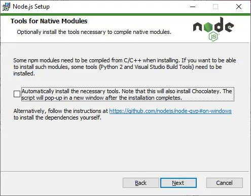
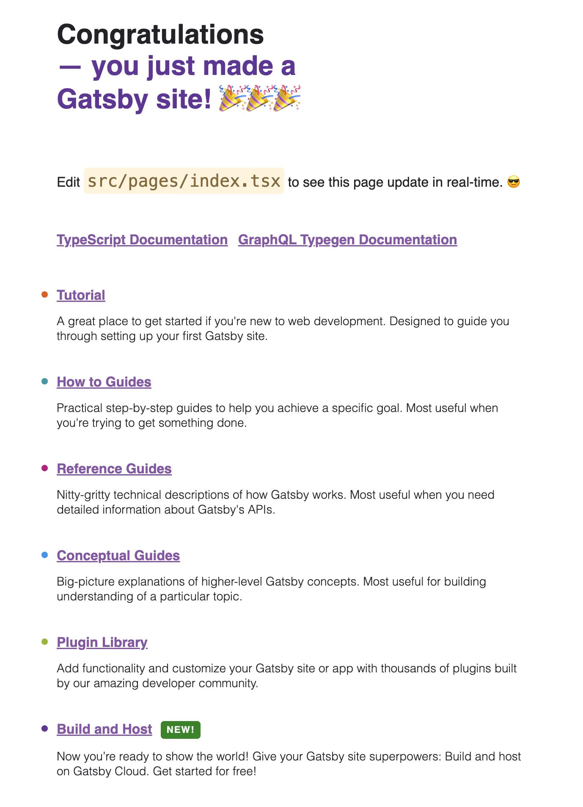

markdown, md 또는 mdx 기반의 블로그를 만들 때 가장 많은 선택을 받는 프레임워크들은 크게 세 가지가 있죠.

바로 [jekyll](https://jekyllrb-ko.github.io/), [Hugo](https://gohugo.io/), [Gatsby](https://www.gatsbyjs.com/)인데요.

이 중 오늘은 Gatsby를 사용해서 블로그를 만드는 방법에 대해 알아보도록 해요.

---

## 1. Gatsby 설치 환경 만들기

macOS와 Windows로 나눠서 설명을 할 예정인데 각 항목별로 이미 설치하신 경우에는 바로 스크롤을 아래로 내려주세요.

물론 [공식문서](https://www.gatsbyjs.com/docs/tutorial/getting-started/part-0/#installation-guide)에도 이미 잘 정리되어 있으니 공식문서를 보고 진행하셔도 무방해요.

### 1-1-1. macOS Node.js 설치하기

우선 Homebrew가 설치됐다고 가정하고 시작할게요.

만약 아직 설치하기 전이라면 [이 포스팅](/posts/2023/09/install-homebrew)을 보고 따라하시면 되요.

brew가 설치된 상태에서 터미널을 열고 아래의 명령어를 실행 시켜요.

(만약 설치 중 오류가 발생하면 [애플 사이트](https://developer.apple.com/download/more/)에서 맥에 로그인한 계정으로 다시 로그인한 후 터미널에서 다시 진행해주세요.)

이후에 소프트웨어 라이센스 동의 여부를 물어보면 동의하고 진행해주세요.

```bash
xcode-select --install
```

이후 homebrew를 사용해서 node.js를 설치해줘요.

```bash
brew install node
```

### 1-1-2. macOS Git 설치하기

git은 개발자라면 기본적으로 사용하는 프로그램이기 때문에 이미 다 설치한 상태겠지만 혹시나 해서 적어둘게요!

```bash
brew install git
```

설치 완료 후 [Github](https://github.com/) 계정을 등록해주세요.

```bash
git config --global user.name "your github name"
git config --global user.email "your github email"
```

### 1-2-1. Windows Node.js 설치하기

Windows에서는 설치가 매우 간단해요.

[공식 사이트](https://nodejs.org/en)를 방문해서 LTS가 붙은 버튼을 클릭해주세요.

그 후 다운받은 .exe 파일을 실행시켜주세요.

설치 중 이 화면이 나오면 체크박스를 클릭 후 진행해주세요!



### 1-2-2. Windows Git 설치하기

Git도 Windows에서는 설치가 매우 간단해요.

[공식 사이트](https://gitforwindows.org/)를 방문 후 Download 버튼을 클릭해서 설치시고 .exe 파일을 실행해주세요.

### 1-3. gatsby-cli 설치 (macOS, Windows 공통)

이제 gatsby command-line-interface를 설치해요.

```bash
npm install -g gatsby-cli
```

설치가 완료되면 잘 설치됐나 확인해요.

```bash
gatsby --version
# Gatsby CLI version: 5.12.4
# Gatsby version: 5.12.9
```

## 2. Gatsby 프로젝트 생성하기

이제 드디어 Gatsby 프로젝트를 생성해볼거에요!

이미 틀이 잡혀있는 템플릿을 사용해서 바로 만들어도 되지만 오늘은 배워보는 것이니 만큼 초기 상태로 프로젝트를 생성해보도록 해요!

```bash
# 프로젝트 생성을 원하는 폴더로 이동 후 진행해주세요.

gatsby new
```

원하시는 블로그 이름을 입력해주세요.

```bash
What would you like to call your site?
✔ · Flash의 블로그
```

원하시는 프로젝트명을 설정해주세요.

```bash
What would you like to name the folder where your site will be created?
✔ {현재 폴더명}/ flash
```

js와 ts 중에 선택해주세요.

저는 당연히 ts를 선택했는데 앞으로 이 글을 계속 따라오실 분들은 ts를 선택해주시고 아니신 분들은 원하시는 언어를 선택해주세요.

앞으로는 ts가 오픈 소스들이나 공동 작업 프로젝트 혹은 회사 등 여러 곳에서 많이 정착될 것으로 예상되니 사용하시는 걸 권장드려요!

```bash
Will you be using JavaScript or TypeScript?
  JavaScript
❯ TypeScript
```

Content Management System을 선택하는 부분인데 이 포스팅의 마지막은 Github에 배포하는 게 목표이기 때문에  No (or I'll add it later)를 선택할게요.

물론, 추후에 원하는 CMS를 선택할 수 있어요.

```bash
? Will you be using a CMS?
(Single choice) Arrow keys to move, enter to confirm
❯ No (or I'll add it later)
  –
  Contentful
  DatoCMS
  Netlify CMS
  Sanity
  Shopify
  WordPress
```

원하시는 스타일링 시스템을 선택하시면 gatsby 플러그인 설정을 자동으로 해줘서 편한 기능이에요.

저는 styled-components를 선택했어요. 

이건 원하시는 걸 선택해주세요.

```bash
? Would you like to install a styling system?
(Single choice) Arrow keys to move, enter to confirm
  No (or I'll add it later)
  –
  Emotion
  PostCSS
  Sass
❯ styled-components
  Theme UI
  vanilla-extract
  Tailwind CSS
```

이번에는 프로젝트 생성에 맞춰 추가되길 원하는 기능들을 선택해주세요.

저는 아래의 네 가지를 선택했어요. 이 블로그 글들을 쭉 따라가실 거라면 제가 선택한 걸 동일하게 선택하는 걸 추천드려요.

다 따라하지 않으시더라도 이 중 Add Markdown and MDX support는 반드시 선택해주세요!

물론 여기서 선택하지 않으셔도 추후에 플러그인을 수동으로 설정하실 수 있으니 걱정마세요!

```bash
? Would you like to install additional features with other plugins?
(Multiple choice) Use arrow keys to move, spacebar to select, and confirm with an enter on "Done"
 ◯ Add the Google gtag script for e.g. Google Analytics
 ◉ Add responsive images
 ◉ Add an automatic sitemap
 ◉ Generate a manifest file
❯◉ Add Markdown and MDX support
 ◯ Add Markdown support (without MDX)
  ─────
  Done
```

마지막으로 지금까지 설정한 것들을 확인하는 절차에요.

실수하신 게 없으시다면 확인하신 후 Yes를 입력해주세요.

```bash
Thanks! Here's what we'll now do:

    🛠  Create a new Gatsby site in the folder flash
    🎨 Get you set up to use styled-components for styling your site
    🔌 Install gatsby-plugin-image, gatsby-plugin-sitemap,
gatsby-plugin-manifest, gatsby-plugin-mdx


? Shall we do this? (Y/n) › Yes
```

## 3. Gastby 프로젝트 실행

설치가 완료되면 아래의 명령어들을 입력해주세요.

```bash
cd {your project name}

yarn develop
```

[http://localhost:8000](http://localhost:8000) 주소를 브라우저로 입력했을 때 아래와 같은 화면이 나오면 성공이에요!



---

## 정리하며

오늘은 Gatsby 블로그 설치 환경과 초기 프로젝트를 생성하고 실행하는 법에 대해 알아봤어요.

앞으로는 mdx 기반으로 블로그 글 쓰는 법과 쓴 글들을 화면에 구성하는 법에 대해 배워볼게요!