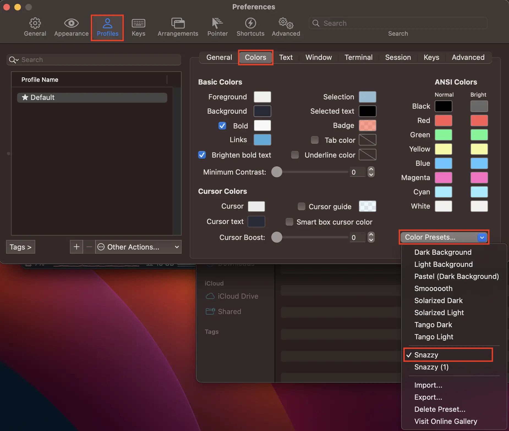
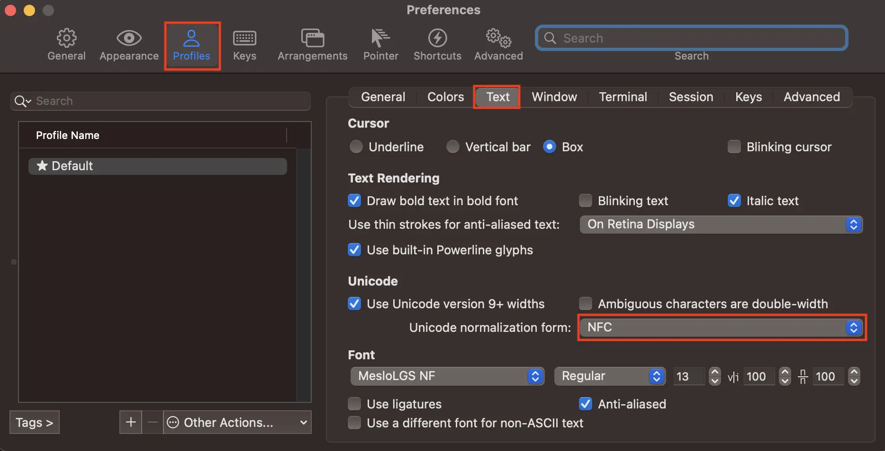
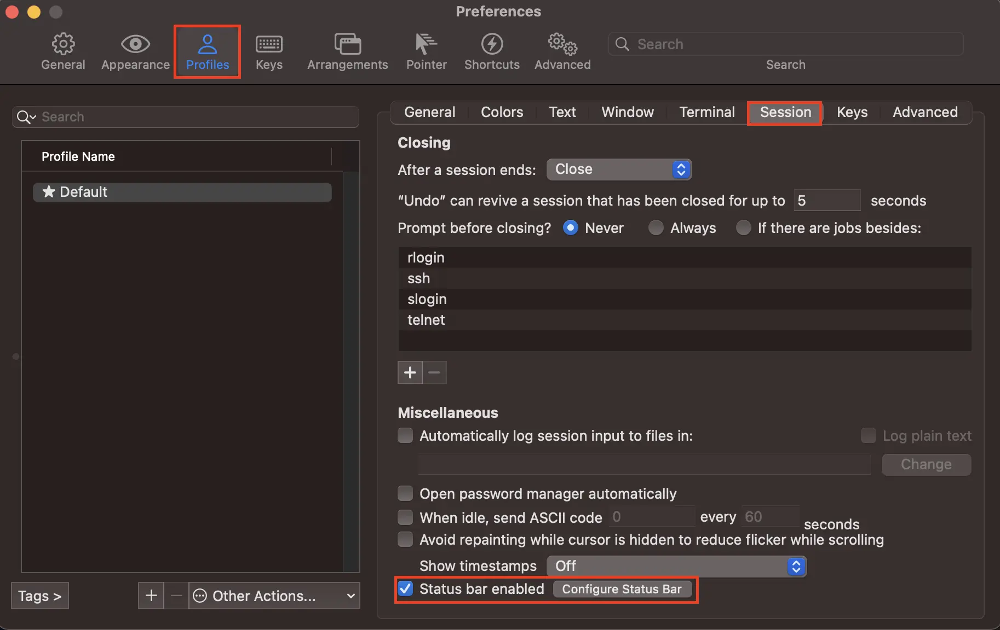
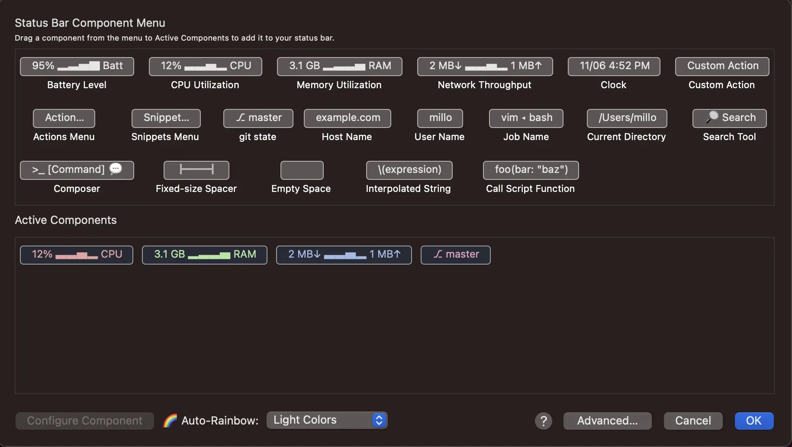
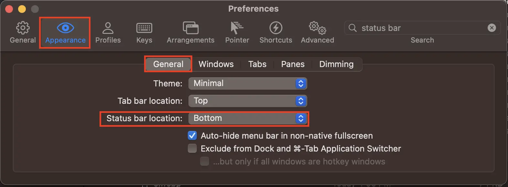

오늘은 mac 필수 앱인 iTerm2를 설치하고 기본 터미널과 다르게 알록달록하게 테마를 적용해봐요.

---

## 1. iTerm2 설치

설치는 brew로 해줄게요.

만약 Homebrew가 설치되어 있지 않으시면 [이 포스팅](/posts/2023/09/install-homebrew)을 따라서 설치하고 돌아와주세요.

이제 아래 명령어를 터미널에 입력해서 설치해주세요.

```bash
brew install iterm2
```

## 2. oh-my-zsh 설치

iterm2에서 여러 가지 테마를 적용하거나 자동완성 등의 기능을 적용하기 위해 zsh(Z shell)의 플러그인 중 하나인 oh-my-zsh를 설치해요.

```bash
sh -c "$(curl -fsSL https://raw.github.com/robbyrussell/oh-my-zsh/master/tools/install.sh)"
```

## 3. iterm 컬러 스킴 및 설정 변경

### 3-1. 컬러 스킴 선택

[공식 사이트](https://iterm2colorschemes.com/)에서 여러 컬러 스킴들을 확인 후 다운로드 받으세요.

저는 개인적으로 파스텔톤이 이뻐서 아래의 Snazzy 컬러 스킴을 다운로드해서 사용 중이에요.

<a download="Snazzy.itermcolors" href="/files/2023/09/Snazzy.itermcolors">Snazzy 테마 다운로드</a>

어떤 테마든 다운로드 받으셨다면 더블 클릭하시면 자동으로 iterm2의 iTerm Color Preset에 추가되요.

확인하기 위해 iTerm2를 실행시킨 후 (⌘ + ,)를 함께 눌러주세요.

그리고 나온 아래와 같은 창에서 Profile -> Colors -> Color Presets... -> Snazzy(또는 다운받은 컬러 스킴)를 선택해주세요.



### 3-2. 한글 깨짐 방지

터미널에서 한글이 깨지는 경우가 많이 발생하는데 아래와 같이 설정해서 한글 깨짐을 방지해주세요.

위와 같은 창에서 Profile -> Text -> Unicode normalization form: NFC 로 변경해주세요.



### 3-3. 상태바 추가

위와 같은 창에서 Profile -> Session -> Status bar enabled를 체크해주시고 오른쪽의 Configure Status Bar를 클릭해주세요.



그럼 아래와 같은 창이 나오는데 터미널에 표시됐으면 하는 컴포넌트를 클릭하시고 확인을 눌러주세요.

저는 CPU Utilization, Memory Utilization, Nework Throughput, git state 총 네 개를 사용하고 있어요.

하단에 Auto-Rainbow에서 색 테마를 선택할 수 있으니 좋아하시는 테마를 선택해주세요.



저는 상태창이 하단에 있는게 좋아서 아래 이미지와 같이 수정했는데 이건 개인 취향이니까 마음껏 변경해주세요.

Appearance -> General -> Status bar location 에서 변경하실 수 있어요.



## 4. 플러그인 설치

이제 oh-my-zsh의 가장 강점인 플러그인들을 설치해봐요.

저는 명령어 하이라이팅 플러그인([zsh-syntax-highlighting](https://github.com/zsh-users/zsh-syntax-highlighting))과 자동완성 플러그인([zsh-autosuggestions](https://github.com/zsh-users/zsh-autosuggestions))을 사용해요.

```bash
# zsh-syntax-highlighting
git clone https://github.com/zsh-users/zsh-syntax-highlighting.git ${ZSH_CUSTOM:-~/.oh-my-zsh/custom}/plugins/zsh-syntax-highlighting

# zsh-autosuggestions
git clone https://github.com/zsh-users/zsh-autosuggestions.git $ZSH_CUSTOM/plugins/zsh-autosuggestions
```

다운로드가 완료되면 ~/.zshrc 파일을 열어서 수정해줘요.

```bash
vi ~/.zshrc
```

```bash
# ~/.zshrc
# ...

plugins=(
    # ...
    zsh-syntax-highlighting
    zsh-autosuggestions
    # ...
)

# ...
```

수정을 완료한 후 아래 명령어로 수정을 적용해줘요.

```bash
source ~/.zshrc
```

## 5. 테마 선택

iterm2 프롬프트에는 [다양한 테마](https://github.com/ohmyzsh/ohmyzsh/wiki/Themes)가 존재하고 해요.

가장 유명한 테마들에는 
[powerlevel10k](https://github.com/romkatv/powerlevel10k), 
[spaceship](https://spaceship-prompt.sh/), 
[pure](https://github.com/sindresorhus/pure) 등 여러 종류가 있지만 그 중 저는  성능이 가장 좋은 powerlevel10k를 사용하고 있어요.

저는 powerlevel10k를 설치해서 적용해볼게요. 다른 테마들도 비슷한 방식으로 설치하고 적용하면 되요.

```bash
git clone --depth=1 https://github.com/romkatv/powerlevel10k.git ${ZSH_CUSTOM:-~/.oh-my-zsh/custom}/themes/powerlevel10k
```

설치 완료 후 ~/.zshrc 파일을 열어서 ZSH_THEME 항목을 수정해요.

```bash
vi ~/.zshrc
```

아래와 같이 ZSH_THEME 부분을 수정해주세요.

```bash
# ~/.zshrc

# ...

ZSH_THEME="powerlevel10k/powerlevel10k"

# ...
```

수정 완료 후에는 아래와 같이 수정 내용을 적용해주세요.

```bash
source ~/.zshrc
```

위 명령어를 실행한 후 새로 탭을 열면, 대화형 설정창이 뜨고 상세하게 테마를 설정할 수 있어요. 

만약, 다시 설정하고 싶으면 p10k configure를 입력해주세요.

---

## 정리하며

오늘은 iTerm2 앱 설치와 알록달록한 테마와 편리한 플러그인들을 추가하는 방법에 대해 알아봤어요.

제가 사용하고 있는 것들이라 100% 강추하는 것들이어서 여러분들한테도 도움이 됐으면 좋겠어요.

다들 iTerm 잘 사용하시고 조금씩 원하는 방향으로 튜닝하시는 걸 추천드려요.