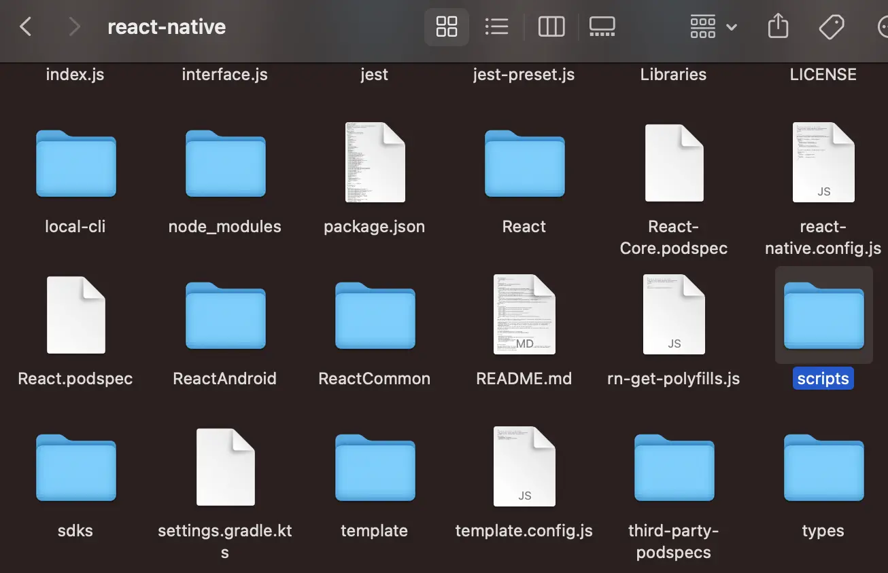
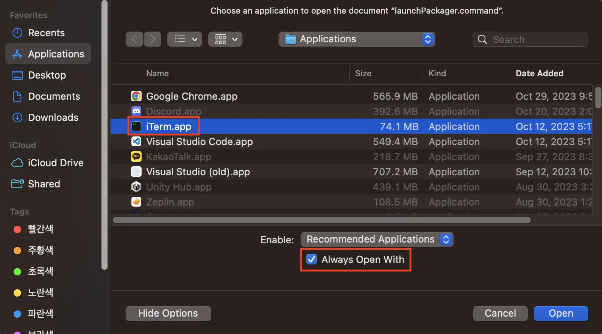
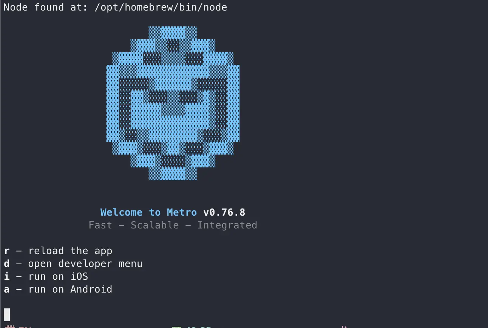

import image from '../../../images/2023/09/boot-7.webp';


오늘은 react-native 0.7 버전 이후에 ios 시뮬레이터를 실행시키면 발생하는 unable to boot device in current state: Booted 오류를 해결하는 방법에 대해 알아봐요.

오류가 나는 이유부터 알아보자면 시뮬레이터를 실행시키기 위해 터미널을 실행시켜야 하는데 해당 권한이 존재하지 않아서 발생하는 문제에요.

그럼 이제 해결 방법에 대해 알아볼까요?

---

## 1. 해결 방법 

### 1-1. 프로젝트 폴더 node_modules 열기

현재 프로젝트의 폴더를 열어서 node_modules 폴더를 열어주세요.


### 1-2. react-native 폴더 열기

node_modules 폴더 안에서 react-native 폴더를 찾아서 열어주세요.


### 1-3. scripts 폴더 열기

./node_modules/react-native 폴더 안에서 scripts 폴더를 찾아서 열어주세요.



### 1-4. launchPackager.command 파일 다른 프로그램으로 열기

./node_modules/react-native/scripts 폴더 안에서 launchPackager.command 파일을 우클릭해서 아래 이미지와 같이 다른 파일로 열기를 클릭해요.


### 1-5. iTerm.app으로 앱 열기

아래 이미지처럼 iTerm.app으로 앱을 설정하고 Always Open With 체크 박스를 클릭한 후 열기를 클릭해요.



### 1-6. iTerm 앱 확인

위에서 열기를 클릭하면 아래와 같이 iTerm이 실행되는 걸 확인하고 창을 꺼주세요.



### 1-7. 다시 앱 실행

원하시는 방식으로 앱을 실행시켜 주세요. 

```bash
npm run ios

# or 
# yarn ios
```


---

## 정리하며

오늘은 react-native 0.7 버전 이후에 ios 시뮬레이터를 실행시키면 발생하는 unable to boot device in current state: Booted 오류를 해결하는 방법에 대해 알아봤어요.

이미지와 함께 보면서 따라오면 큰 어려움 없이 해결하실 수 있으니 차근차근 따라해서 해결하셨으면 좋겠어요.