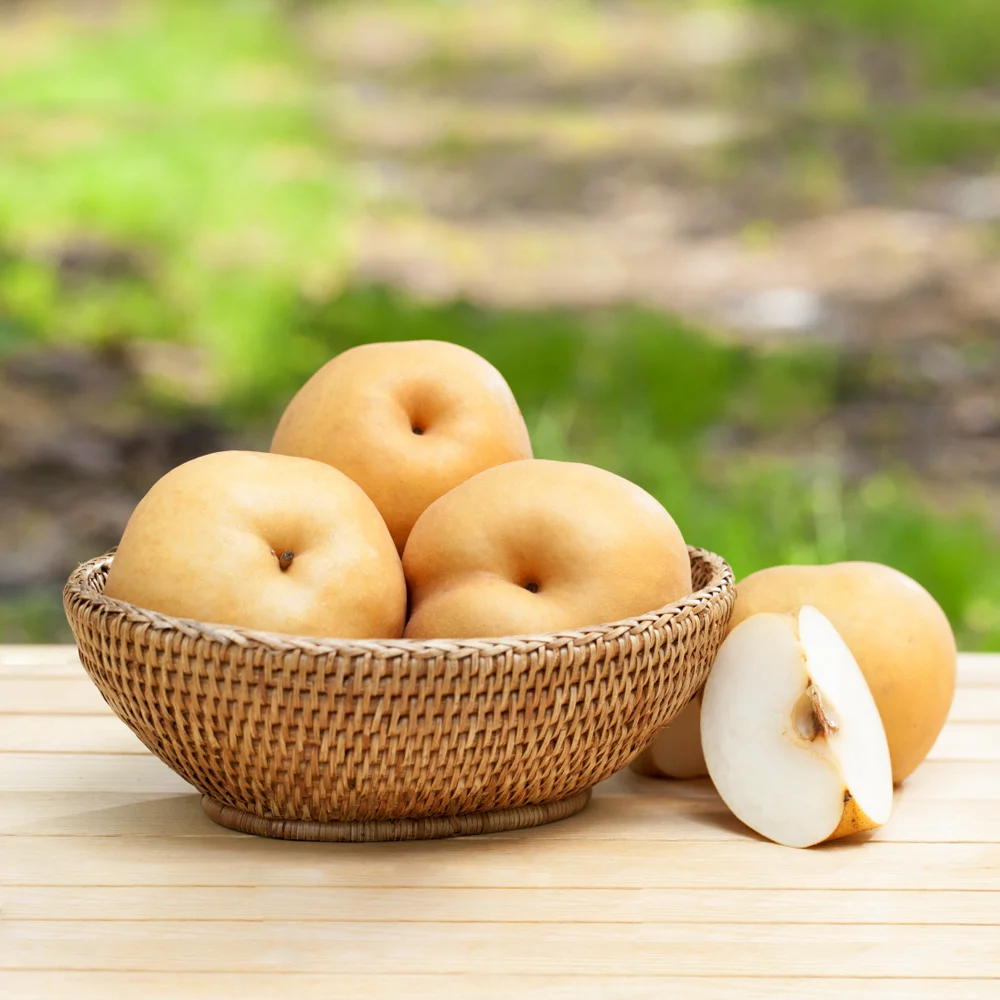
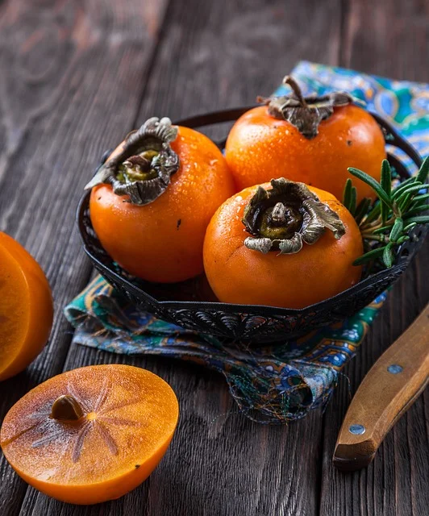
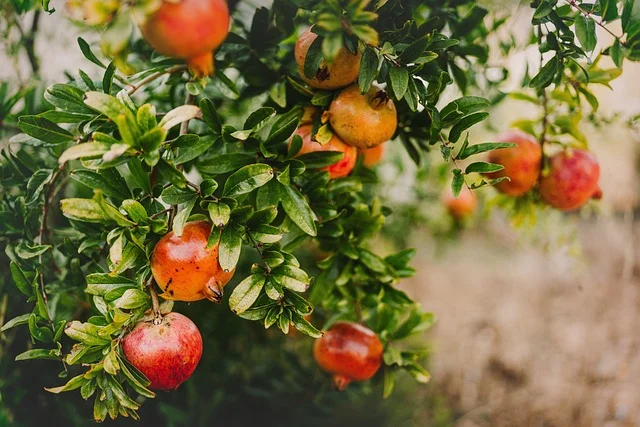
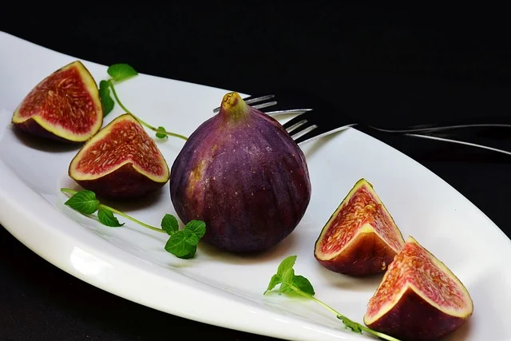
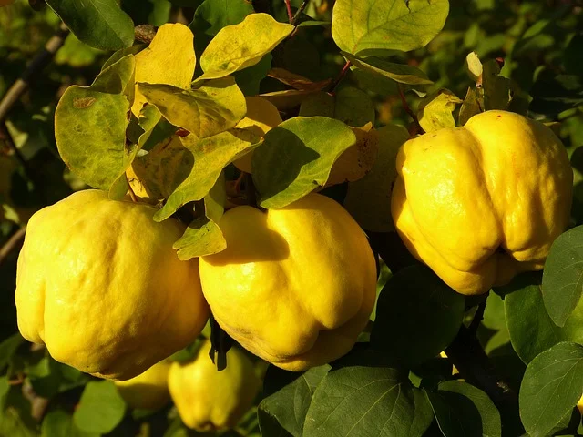

{/* import apple from "../../../images/2023/10/apples-1.webp"; */}

유난히 더웠던 올해 여름이 지나가고 있네요. 여름이 지나면 선선하고 실한 과일도 많이 먹을 수 있는 계절인 가을이 찾아오는데요.

요새는 비닐하우스가 많아서 다양한 과일을 계절에 상관없이 먹을 수 있지만 그래도 제철 과일은 퀄리티가 다르잖아요~! 

그래서 준비했습니다. 제철 과일 가을편!

---

## 가을 제철 과일 종류와 효능은?

이제 제철 과일들을 소개하면서 여러 가지 효능들을 소개할 거에요!

아무리 좋은 효능이라도 너무 과하면 독이 되는 거 모두 아시죠?? 제철 과일이 아무리 맛있고 효능이 좋아도 우리 모두 정량 섭취를 통해서 더 건강한 사람들로 거듭나요!

## 1. [제철 과일] 사과

{/* 

{`http://localhost:8000${apple}`}

<MdxImage src={`http://localhost:8000${apple}`} />
<StaticImage src={`http://localhost:8000${apple}`} alt="hello" />
<GatsbyImage image={`http://localhost:8000${apple}`} alt="hello" /> */}

첫 번째 제철 과일은 가장 익숙한 사과인데요! 사과는 예로부터 여러 장점을 가진 슈퍼 푸드로 알려져왔습니다. 그럼 어떤 장점들이 있는지 한 번 볼까요??

1. 칼로리가 낮고 섬유질이 많아 체중 감량에 좋은 간식이에요.
2. 산화 방지제가 풍부해서 손상으로부터 여러분의 세포를 보호해줘요.
3. 면역력을 높이는 데 도움을 줄 수 있는 비타민 C의 좋은 공급원이에요.
4. 콜레스테롤 수치를 낮춰주는 수용성 섬유질을 함유하고 있어요.
5. 폴리페놀이 풍부해서 체내의 염증을 줄여줘요.
6. 뇌 기능을 향상시키고 알츠하이머 병의 위험을 줄여줘요.
7. 특정한 종류의 암의 위험을 줄여줘요.
8. 폐 기능을 향상시키고 천식의 위험을 줄여줘요.
9. 뼈 건강을 증진시키고 골다공증의 위험을 줄여줘요.
10. 장에서 좋은 박테리아의 성장을 촉진함으로써 장 건강을 향상시켜요.

## 2. [제철 과일] 배

두 번째 제철 과일은 배에요. 사과와 마찬가지로 우리에게 엄청 친숙한 과일이죠. 그런데 그런 배에 이런 효능들이 있다는 사실 알고 계셨나요??

1. 수분과 섬유질이 풍부해서 갈증 해소에 따봉이에요.
2. 소화에 좋아 장을 건강하게 해주고 변비를 예방해줘요.
3. 알코올을 분해하는 효능이 있어 숙취 제거에 따봉이에요.
4. 감기 예방과 가래 제거 효능이 있어 일교차가 심한 가을에 따봉이에요.
5. 콜레스테롤 수치를 낮춰주는 효능이 있어 혈관을 깨끗하게 해줘요.
6. 동맹경화 등의 심혈관 건강에 따봉이에요.
7. 인체 열을 내려주는 효과가 있어 감기나 두통에 따봉이에요.
8. 당분 함량은 높지만 자혈당 부하지수가 낮아서 혈당 안정에 따봉이에요.
9. 칼륨 함량이 높아 고혈압 예방에 따봉이에요.
10. 체내 노폐물과 독소 배출 효과가 있어 이뇨작요에 따봉이에요.

## 3. [제철 과일] 감

세 번째 제철 과일은 감이에요. 추석에는 사과, 배와 같이 차례상에 올라가기도 하고 친숙한 과일이죠. 감은 가을에 수확되고 그냥 깎아먹어도 맛있고, 곶감으로 먹어도 참 맛있는 것 같아요. 그런 감도 이런 효능이 있답니다!

1. 함류된 비타민C가 무려 사과의 10배에 달해서 피부 영양 공급, 활성산소 제거에 따봉이에요.
2. 스코플레틴 성분이 다량 함유돼 고혈압이나 동맥경화 등 심혈관질환 예방에 따봉이에요.
3. 비타민A가 풍부해 안구 건조증, 백내장 예방 등 눈 건강에도 따봉이에요.
4. 떫은 맛을 내는 '탄닌' 성분이 혈액 응고를 도와 지혈과 살균작용에 따봉이에요.
5. 아세트알데하이드의 분해를 촉진시켜 숙취 해소에 따봉이에요.
6. 체내의 신진대사를 촉진해 환절기 면역력 강화에 따봉이에요.

## 4. [제철 과일] 석류

네 번째 제철 과일은 석류에요. 개인적으로는 석류는 먹기가 너무 불편하고 씨가 많이 나와서 선호하지 않는 편이에요. 그래도 맛은 정말 좋아서 주변 사람들은 모두 좋아하는 과일이 아닌가 싶어요. 그런 석류는 과연 어떤 장점들이 있을까요?

1. 항암 효과가 있어요. 특히, 남성 전립선암에 따봉이에요.
2. 집중력과 활력을 높여주고 불안과 만성피로에 따봉이에요.
3. 뇌 손상과 같은 신경장애 완화에 따봉이에요.
4. 칼륨이 풍부해서 이뇨 작용을 도와 독소 배출과 다이어트에 따봉이에요!
5. 폴리페놀이라는 항산화 물질이 풍부하게 함유해서 면역 강화에 따봉이에요!
6. 간의 독소 제거 및 혈류 개선에 따봉이에요!
7. 콜레스테롤 수치 저하와 고혈압 예방에 따봉이에요!

## 5. [제철 과일] 무화과

다섯 번째 제철 과일은 무화과에요. 무화과는 자른 상태로 바로 먹어본 적은 거의 없는 것 같고, 디저트에 들어갔을 때 몇 번 먹어봤는데 달달하고 맛있더라고요! 이 포스팅 쓰면서 저도 구매해보려고요. 그런 무화과도 이렇게나 많은 효능이 있어요.

1. 칼로리가 다소 있는 편이어서 공복감 해결에 따봉이에요.
2. 섬유질이 풍부해 변비 완화와 소화기 계통 건강에 따봉이에요.
3. 혈중 중성지방을 낮춰서 심혈관계 질환 예방에 따봉이에요.
4. 펙틴이라는 수용성 섬유질과 세로토닌을 생성하는 비타민B6를 함유해 콜레스테롤을 낮춰줘요.
5. 철분 함량이 많아 빈혈에 따봉이에요.
6. 비타민K, 칼슘, 칼륨, 마그네슘 등을 많이 함유해 골다공증에 따봉이에요.
7. 아연, 마그네슘, 칼슘, 칼륨 등이 풍부해 산화질소 생성 증가 및 불임, 발기부전 등의 성기능 장애에 따봉이에요.
8. 오메가3와 마그네슘, 멜라토닌 생성에 도움을 주는 트립토판이 들어있어 불면증 방지에 따봉이에요.

## 6. [제철 과일] 모과

마지막 제철 과일은 모과에요. 모과는 항상 방향제 대신으로만 사용해왔는데 실제로 먹는 분들은 향이 좋은 만큼 차로 우려서 많이 드시더라고요. 얼마나 효능이 좋은지 한 번 볼까요??

1. 비타민, 구연산, 사과산, 플라보노이드 등이 풍부해 감기 예방과 만성 기침에 따봉이에요.
2. 몸살이나 근육통, 단백성 관절염 부종억제, 연골 조직을 부드럽게 하는 데 따봉이에요.
3. 비타민, 사포닌, 탄닌 등이 풍부해 호흡기 질환 예방과 목 염증 완화에 따봉이에요.
4. 임신 초기 입덧의 원인인 위장 장애 증상 완화에 따봉이에요.

---

## 정리하며

오늘은 가을의 제철 과일 종류와 각각의 효능에 대해 알아봤어요. 이렇게만 적어도 글이 너무 길어져서 보관 방법 등에 대해서는 적지 못했는데 다음에 기회가 된다면 각 과일들의 보관 방법들에 대해서도 적어보도록 할게요.

###### 이 포스팅은 쿠팡 파트너스 활동의 일환으로, 이에 따른 일정액의 수수료를 제공받습니다.